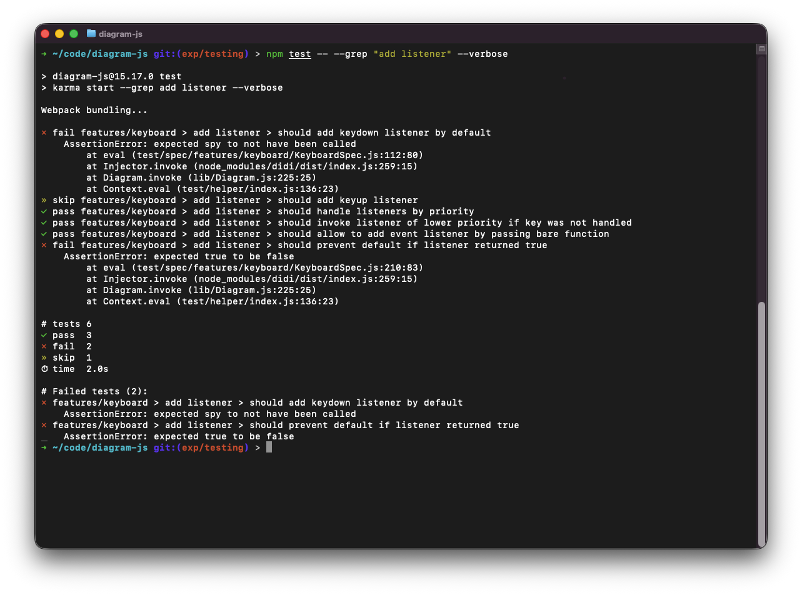

# karma-tldr-reporter

[](https://github.com/bpmn-io/karma-tldr-reporter/actions/workflows/CI.yml)

A minimal karma reporter optimized for humans and AI/log scrapers.

#### TL;DR:

- failures-only live output by default
- `--verbose` / `-v` to stream every pass/skip line
- `--grep` / `-g` forwarded to mocha (run a subset of tests)
- compact, greppable summary of failed tests at the end

## Install

```
npm install --save-dev karma-tldr-reporter
```

## Usage

Keep your existing karma + webpack config. Just add the reporter:

```js
// karma.conf.js
module.exports = function(config) {
  config.set({
    // ... your existing config ...
    reporters: [ 'tldr' ]
  });
};
```

## Options (CLI)

```
npm test                          # failures-only output
npm test -- --verbose             # also print every pass/skip  (alias: -v)
npm test -- --grep "should add"   # run only matching tests     (alias: -g, or --grep=...)
```

## Example output

[](./example.png)

ANSI color is used only when stdout is a TTY and `NO_COLOR` is unset.

## License

MIT
